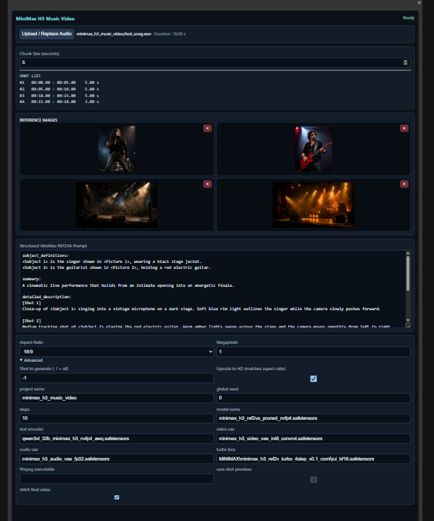

# ComfyUI MiniMax H3 Music Video

One ComfyUI output node that turns a master song into sequential, locally rendered MiniMax H3 REF2VA shots.

## Why it can process a long song

The node does not ask MiniMax H3 to generate one video covering the entire song. It divides the master audio into short chunks and generates one independent video shot for each chunk. A three-minute song with a five-second chunk size therefore becomes 36 separate generations rather than one three-minute generation.

After a shot is decoded, the node immediately streams its frames through FFmpeg and saves it as a silent `shot_###.mp4` file. It keeps only the completed file path for final assembly; it does not retain every completed video's frames in memory. Before starting the next shot, the node releases its references to the current audio-chunk tensor and decoded-frame tensor. Temporary tensors created inside the per-shot render call also leave that call's scope when it returns.

The MiniMax model pipeline is deliberately created once and retained for the whole queue operation. The loaded model, text encoder, video and audio VAEs, sampler, and reference images can therefore be reused by the next shot instead of being loaded again for every chunk. ComfyUI and PyTorch remain responsible for their normal model, allocator, and device-memory management. The node does not explicitly empty the CUDA allocator cache or unload and reload the models between shots.

This design prevents the decoded frames for the complete music video from accumulating in memory, but it does not mean that all GPU memory is cleared after every shot. The memory required by the loaded models, reusable references, ComfyUI caches, and the current generation remains necessary. Very long projects are therefore possible in principle, but are still experimental and can take a long time or fail if an individual shot exceeds the available memory.

When the full sequence finishes with **Shot to generate** set to `-1` and **Stitch final video** enabled, FFmpeg concatenates the silent shot files in numeric order and muxes the original master audio into `final_music_video.mp4`. The master song is added once at this final stage; it is not repeatedly joined at every shot boundary.

Automatic stitching is optional. Disable **Stitch final video** to keep only the separate silent shot files, then arrange, trim, transition, or replace them in a video editor or another third-party tool. To reproduce the node's basic final assembly manually, concatenate the shots in numeric order and add the original master song as the final video's audio track.

## What it does

- Uploads one master audio file and plans `ceil(duration / chunk size)` shots.
- Accepts up to four ordered reference images with in-node thumbnails.
- Splits one structured prompt by explicit `[Shot N]` markers and validates the count before loading models.
- Slices the ComfyUI `AUDIO` tensor exactly for each shot.
- Runs MiniMax H3 REF2VA sequentially with the selected audio chunk as both reference audio and a forced, zero-noise audio latent.
- Generates at 24 FPS using the H3 `5 mod 17` frame rule, then trims every decoded shot to its real duration.
- Always writes silent `shots/shot_###.mp4` files. It can additionally create per-shot audio previews.
- Advanced settings can render every shot (`-1`) or only one displayed, 1-based shot index.
- An optional final Lanczos resize uses the supplied workflow's active `ImageResizeKJv2` settings—crop, centered, divisible by 2, on CPU—at aspect-aligned HD dimensions: 1920×1080 for 16:9, 1080×1920 for 9:16, 1080×1080 for 1:1, 1440×1080 for 4:3, 1080×1440 for 3:4, and 2520×1080 for 21:9.
- Optionally concatenates the silent shots and muxes the original uploaded master audio once into `final_music_video.mp4`.

The node is registered as **MiniMax H3 Music Video** in the **Music Video** category.

## Required local models

Defaults mirror the active REF2VA path in the supplied workflow:

- `models/diffusion_models/minimax_h3_ref2va_pruned_nvfp4.safetensors`
- `models/text_encoders/qwen3vl_32b_minimax_h3_nvfp4_awq.safetensors`
- `models/vae/minimax_h3_video_vae_int8_convrot.safetensors`
- `models/vae/minimax_h3_audio_vae_fp32.safetensors`
- `models/loras/MINIMAX/minimax_h3_ref2v_turbo_4step_v0.1_comfyui_bf16.safetensors`

Use a current ComfyUI build containing the MiniMax H3 nodes plus KJNodes and SageAttention for the two attention patches selected by the source workflow. `ffmpeg` must be on `PATH`, or its full executable path must be entered under Advanced.

## How to use

### Step by step

1. Start ComfyUI and add **Music Video → MiniMax H3 Music Video** to the workflow.
2. Select **Upload / Replace Audio** and choose the song that will become the video's master audio.
3. Set **Chunk Size**. The default is `5.0` seconds. The shot list updates automatically after the audio is loaded.
4. Add at least one reference image. Images are assigned in order as `<Picture 1>`, `<Picture 2>`, and so on, so use the same picture numbers in the prompt.
5. Write one `[Shot N]` section for every shot displayed in the shot list. The number of sections must match exactly.
6. Choose the aspect ratio and resolution size.
7. Open **Advanced** and enter a short, filesystem-safe **project name**, such as `twelve_second_demo`. This name determines the output folder.
8. Leave **Shot to generate** at `-1` and **Stitch final video** enabled to generate every shot and assemble the complete music video.
9. Press ComfyUI's **Queue Prompt** (play) button once.
10. Wait while the node renders each shot sequentially. The node displays the current shot and processing stage. Video generation can take a considerable amount of time depending on the GPU, resolution, and number of shots.

### Example: a 12-second song

With a 12-second song and a chunk size of `5.0`, the node creates three shots:

| Shot | Audio range | Duration |
| --- | --- | --- |
| 1 | `00:00–00:05` | 5 seconds |
| 2 | `00:05–00:10` | 5 seconds |
| 3 | `00:10–00:12` | 2 seconds |

The prompt therefore needs exactly three shot sections. For example:

```text
subject_definitions:
<Subject 1> is the singer shown in <Picture 1>, wearing a black stage jacket.
<Subject 2> is the guitarist shown in <Picture 2>, holding a red electric guitar.

summary:
A cinematic live performance that builds from an intimate opening into an energetic finale.

detailed_description:
[Shot 1]
Close-up of <Subject 1> singing into a vintage microphone on a dark stage. Soft blue rim light outlines the singer while the camera slowly pushes forward.

[Shot 2]
Medium tracking shot of <Subject 2> playing the red electric guitar. Warm amber lights sweep across the stage and the camera moves smoothly from left to right.

[Shot 3]
Wide final shot showing <Subject 1> and <Subject 2> performing together as bright backlights flare behind them. The camera pulls back and holds on the final pose.

overall_soundscape:
The supplied master song drives the timing and atmosphere of the complete performance.

non_diegetic_music:
Use the supplied master song continuously as the music track.
```



The headings before the first shot and the soundscape sections are shared across all generated shots. Each `[Shot N]` body should describe only that part of the video. Shot markers must appear on their own lines and should be numbered in order.

### Output files

For a project named `twelve_second_demo`, output is written to:

```text
ComfyUI/output/MiniMaxH3MusicVideo/twelve_second_demo/
```

The folder contains:

```text
final_music_video.mp4
shots/shot_001.mp4
shots/shot_002.mp4
shots/shot_003.mp4
```

The individual shot files are silent. `final_music_video.mp4` joins the completed shots and adds the original master song once. If **Save shot previews** is enabled, the `shots` folder also receives preview videos containing the corresponding audio chunks.

To regenerate only one shot, enter its displayed, 1-based number under **Shot to generate** and queue the node again. Only that shot file is replaced, and final stitching is skipped. Set the value back to `-1` and queue once more to render all shots and create the final video. Upscaling is disabled by default.

### Experimental: long music videos

The node can plan a much longer song as one workflow, although long-form generation is experimental and can require considerable rendering time. For example, a song lasting exactly three minutes contains 180 seconds. With a `5.0`-second chunk size, the node plans:

```text
180 seconds / 5 seconds = 36 shots
```

The structured prompt must therefore contain exactly 36 sections, from `[Shot 1]` through `[Shot 36]`. A song lasting `03:02` would instead produce 37 shots: thirty-six 5-second shots followed by one 2-second shot. Always follow the shot list displayed by the node rather than calculating the count manually.

One possible four-image reference arrangement is:

| Reference | Purpose |
| --- | --- |
| `<Picture 1>` | Lead singer |
| `<Picture 2>` | Band and instruments |
| `<Picture 3>` | First performance location |
| `<Picture 4>` | Second performance location |

Define those references once before the first shot and reuse the same names throughout the prompt:

```text
subject_definitions:
<Subject 1> is the lead singer shown in <Picture 1>. Preserve their face,
hairstyle, clothes, and identity throughout the video.

<Subject 2> is the band shown in <Picture 2>. Preserve the appearance,
instruments, clothing, and arrangement of the band members.

<Location 1> is the concert stage shown in <Picture 3>. Preserve its lighting,
stage structure, backdrop, and atmosphere.

<Location 2> is the abandoned warehouse shown in <Picture 4>. Preserve its
windows, concrete walls, floor, and industrial architecture.

summary:
A cinematic performance alternating between the concert stage and the
abandoned warehouse. The singer and band remain visually consistent.

detailed_description:
[Shot 1]
At <Location 1>, close-up of <Subject 1> at the microphone as the opening music
begins. Blue backlighting, subtle haze, and a slow camera push forward.

[Shot 2]
At <Location 1>, medium-wide shot of <Subject 2> beginning to perform behind
<Subject 1>. The camera moves slowly from left to right.

[Shot 3]
At <Location 2>, <Subject 1> walks through the warehouse while singing. Soft
daylight enters through the high windows. Smooth tracking shot.

...continue with one section for every displayed shot...

[Shot 36]
At <Location 1>, wide final shot of <Subject 1> and <Subject 2> completing the
performance together. The stage lights flare as the camera pulls back and the
performers hold their final pose.

overall_soundscape:
The supplied master song controls the timing, energy, and atmosphere of every
shot.

non_diegetic_music:
Use the supplied master song continuously throughout the completed video.
```

The long text acts as a shot plan. During rendering, the node extracts the shared definitions, the current shot description, and the shared soundscape information; it does not send all 36 shot descriptions to MiniMax for every shot. All selected reference images are supplied again for each generation.

Keep each shot description focused on an action that can happen within that chunk's duration. Reuse the same subject and location names consistently, and avoid introducing multiple complicated actions into a single five-second shot.

Each shot is generated independently. The reference images encourage consistency, but the previous generated shot is not passed into the next generation. Perfect continuity of faces, poses, costumes, lighting, camera positions, and background details is therefore not guaranteed.

Before committing to a complete long render, write the full prompt with the required number of sections and test representative shots using **Shot to generate**. For example, test an early shot, a location change, and a final shot. Single-shot mode still requires the complete prompt to contain one section for every planned audio chunk. When the results are satisfactory, set **Shot to generate** back to `-1`, keep **Stitch final video** enabled, and queue the complete render.

An example workflow is in `examples/minimax_h3_music_video.json`.
